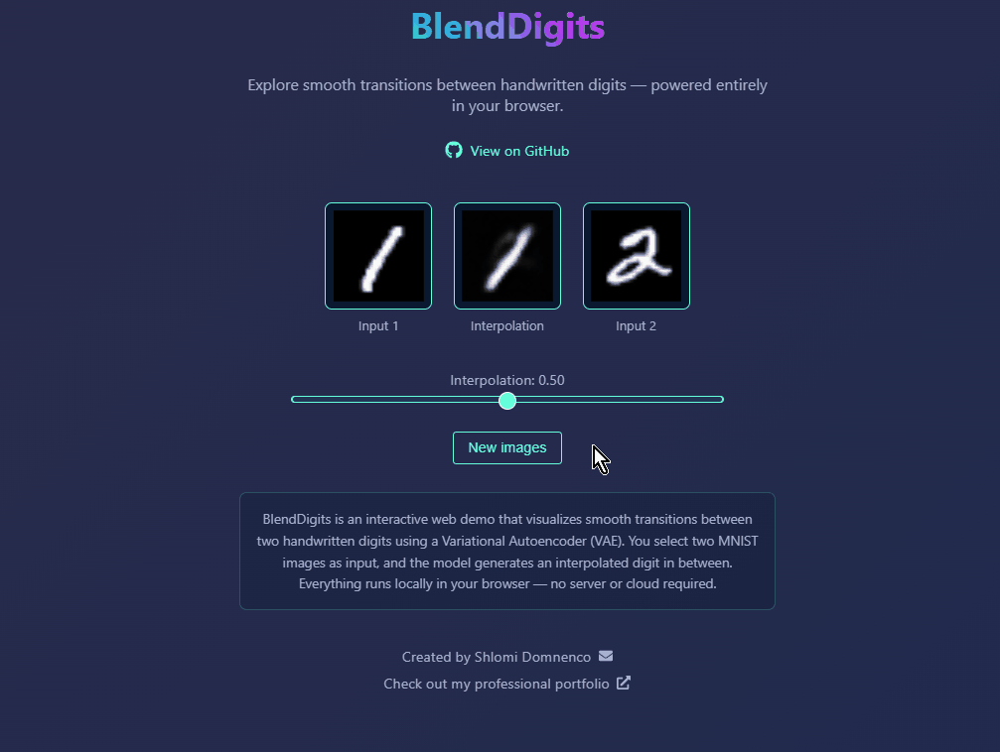
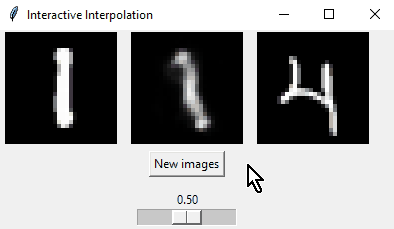

# BlendDigits

BlendDigits is a project that demonstrates the power of Variational Autoencoders (VAEs) in creating smooth transitions between handwritten digits. The project consists of two main components:

1. A web-based interactive demo
2. A Python-based interactive program

I wanted to explore running ML models on the browser client side, so I built this project.

## Web Demo

The web demo provides a user-friendly interface to explore digit interpolation in real-time. Built with React and TypeScript, it allows users to:

- Select two different MNIST digits
- Interpolate between them using a slider
- View the smooth transition in real-time

The demo runs entirely in the browser using ONNX Runtime Web, making it fast and accessible without requiring any server-side processing.

## Interactive Program

The Python-based interactive program provides a more technical interface for exploring the VAE's capabilities. The model has 1.189M parameters and was trained in two phases:

- Initial training for 20 epochs
- Fine-tuning for 20 additional epochs on noisy images (with added Gaussian noise)

This dual-phase training enables the model to not only interpolate between digits but also denoise images effectively.

### Model Details

- Architecture: Variational Autoencoder
- Parameters: 1.189M
- Training: 40 epochs total (20 + 20)

## Getting Started

### Web Demo

1. Navigate to the `frontend` directory
2. Install dependencies: `npm install`
3. Start the development server: `npm run start`
4. Open your browser to `http://localhost:3000`

### Interactive Program

1. Install required Python packages: `pip install -r requirements.txt`
2. Run the interactive program: `python interactive_program.py`

## Project Structure

- `frontend/` - Web demo implementation
- `main.ipynb` - Model training notebook
- `interactive_program.py` - Python-based interactive program
- `model.py` - VAE model implementation from scratch along with InteractiveModel class (wrapper around VAE so the input are two images, VAE input is a single tensor)
- `ae_model.py` - The VAE model is based on this Autoencoder model, which I built.
- `export_vae_model_to_onnx.py` - Exports the InteractiveModel model to ONNX format for the web demo
- `vae_model.pth` - Trained VAE model
- `interpolation_model.pth` - Wrapper for the VAE model, it also loads the `vae_model.pth` weights
- `frontend/public/mnist/` - MNIST dataset. Because we can't upload the entire dataset, I took 30 images from each digit and saved them in the `frontend/public/mnist/` directory.

## License

This project is open source and available under the MIT License.

## Author

Shlomi Domnenco
