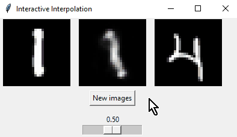

# Interactive digit interpolation

I implemented a simple variational autoencoder model to interpolate between two MNIST digits.

The VAE model has 1.189M parameters and was trained for 20 epoches, then fine-tuned with 20 more epoches on noisy images (Gaussian noise was added to the input images). So the model can also denoise.

## How to use

See the notebook for training and the model implementation: `main.ipynb`

To run the interactive program, run: `python interactive_interpolation.py`
